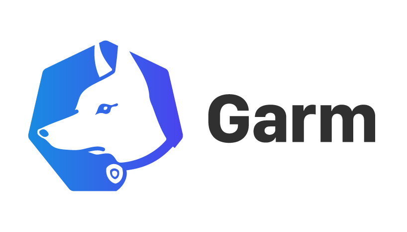
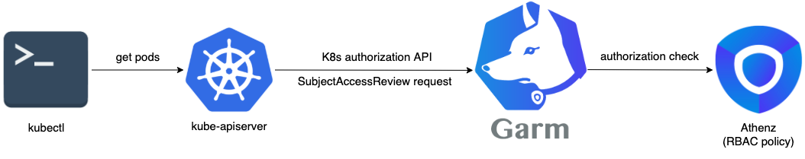

# Garm

[](https://opensource.org/licenses/Apache-2.0)
[](https://github.com/yahoojapan/garm/releases/latest)
[](https://hub.docker.com/r/yahoojapan/garm/tags)
[](https://circleci.com/gh/yahoojapan/garm)
[](https://codecov.io/gh/yahoojapan/garm)
[](https://goreportcard.com/report/github.com/yahoojapan/garm)
[](https://golangci.com/r/github.com/yahoojapan/garm)
[](https://www.codacy.com/app/i.can.feel.gravity/garm?utm_source=github.com&amp;utm_medium=referral&amp;utm_content=yahoojapan/garm&amp;utm_campaign=Badge_Grade)
[](http://godoc.org/github.com/yahoojapan/garm)
[](https://depshield.github.io)
[](code_of_conduct.md)



<!-- TOC insertAnchor:false -->

- [Garm](#garm)
    - [What is Garm](#what-is-garm)
    - [Use Case](#use-case)
        - [Authorization](#authorization)
        - [Docker](#docker)
        - [Usage](#usage)
    - [CI/CD](#cicd)
    - [Future Work](#future-work)
    - [License](#license)
    - [Contributor License Agreement](#contributor-license-agreement)
    - [About releases](#about-releases)
    - [Authors](#authors)

<!-- /TOC -->

## What is Garm



Garm implements the Kubernetes authorization webhook interface to provide access control on your K8s resources with [Athenz](https://github.com/AthenZ/athenz) RBAC policy. It allows flexible resource mapping from K8s resources to Athenz ones, mutli-tenancy, and black/white list.

By default, Garm replies the native Kubernetes authentication for authorization. However, it also supports the Kubernetes authentication webhook. Using the authentication hook requires Athenz to be able to sign tokens for users.

Requires go 1.14 or later.

## Use Case

### Authorization


[](https://app.fossa.io/projects/git%2Bgithub.com%2Fyahoojapan%2Fgarm?ref=badge_shield)

1. K8s webhook request (SubjectAccessReview) ([Webhook Mode - Kubernetes](https://kubernetes.io/docs/reference/access-authn-authz/webhook/))
    - the K8s API server wants to know if the user is allowed to do the requested action
2. Athenz RBAC request ([Athenz](http://www.athenz.io/))
    - Athenz server contains the user authorization information for access control
    - ask Athenz server is the user action is allowed based on pre-configured policy

Garm convert the K8s request to Athenz request based on the mapping rules in `config.yaml` ([example](./config/testdata/example_config.yaml)).

- [Conversion logic](./docs/garm-functional-overview.md)
- [Config details](./docs/config-detail.md)

P.S. It is just a sample deployment solution above. Garm can work on any environment as long as it can access both the API server and the Athenz server.

### Docker
```shell
$ docker pull yahoojapan/garm
```

### Usage

- [install Garm](https://github.com/yahoojapan/garm/blob/master/docs/installation/02.%20install-garm.md)
- [configure k8s webhook](https://github.com/yahoojapan/garm/blob/master/docs/installation/03.%20config-k8s-in-webhook-mode.md)
- [configure Athenz & Garm yaml](./docs/config-detail.md)

## CI/CD

- [CircleCI](https://circleci.com/gh/yahoojapan/garm)

## Future Work

1. Authentication support for Garm
2. Helm Support
3. mTLS Support between Athenz and Garm
4. multi Athenz domain support

## License
```markdown
Copyright (C)  2018 Yahoo Japan Corporation Athenz team.

Licensed under the Apache License, Version 2.0 (the "License");
you may not use this file except in compliance with the License.
You may obtain a copy of the License at

    http://www.apache.org/licenses/LICENSE-2.0

Unless required by applicable law or agreed to in writing, software
distributed under the License is distributed on an "AS IS" BASIS,
WITHOUT WARRANTIES OR CONDITIONS OF ANY KIND, either express or implied.
See the License for the specific language governing permissions and
limitations under the License.
```

[](https://app.fossa.io/projects/git%2Bgithub.com%2Fyahoojapan%2Fgarm?ref=badge_large)

## Contributor License Agreement

This project requires contributors to agree to a [Contributor License Agreement (CLA)](https://gist.github.com/ydnjp/3095832f100d5c3d2592).

Note that only for contributions to the garm repository on the [GitHub](https://github.com/yahoojapan/garm), the contributors of them shall be deemed to have agreed to the CLA without individual written agreements.

## About releases

- Releases
    - [](https://github.com/yahoojapan/garm/releases/latest)
    - [](https://hub.docker.com/r/yahoojapan/garm/tags)

## Authors

- [kpango](https://github.com/kpango)
- [kevindiu](https://github.com/kevindiu)
- [WindzCUHK](https://github.com/WindzCUHK)
- [tatyano](https://github.com/tatyano)
- [rinx](https://github.com/rinx)

